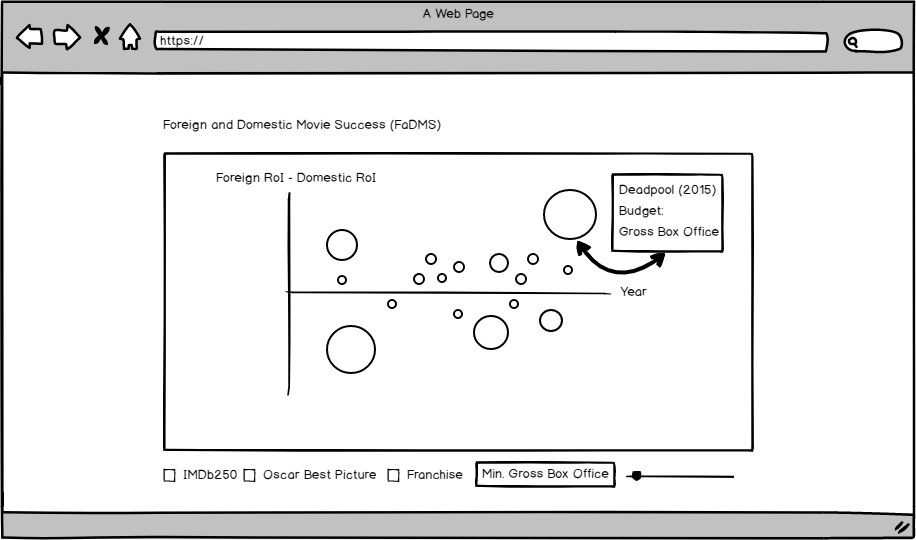

# Movies-Return-on-Investment

## Foreign and Domestic Movie Success (FaDMS)
#### Live:

## Background and Overview
  FaDMS is a data visualization of the differing levels of success movies have in foreign and domestic markets. As the number of movie consumers in foreign markets grow, it is imperative to understand what movies are successful not just at home, but overseas as well.

  Unlike other movie data visualizations, FaDMS prioritizes return on investment(RoI) as its measure of commercial success rather than just gross profit.

## Functionality and MVPs
   In FaDMS, users will be able to:

  - [ ] see the difference in foreign and domestic box office success for their favorite movies
  - [ ] hover over the movie to see a detailed breakdown of the movie's stats
  - [ ] choose selectors such as genre, franchises, IMDb Top 250, and Oscar Best Picture winners

## Wireframes
  FaDMS is a single page app that displays an interactive scatterplot with each point's size depending on the gross profit. The x-axis will be the year of the movie's release and the y-axis will be the difference between the movie's foreign RoI and the movie's domestic RoI (foreign RoI - domestic RoI).

  When a user hovers over a point, the movie's name and information will pop up.

## Architecture and Technologies
This project will be implemneted with the following technologies:
* Vanilla JavaScript for overall structure
* D3 for DOM manipulation
* Webpack to bundle

There will be 2 scripts involved in this project:
`movie.js` - deals with each individual movie item
`selector.js` - deals with handling which group to call (Oscar Winners, IMDb 250, Franchises, All, etc)
`graph.js` - handles calculations and graph rendering

## Implementation Timeline
#### Over the weekend:
- [ ] Research D3 and run through its tutorial
#### Day 1:
- [ ] Set up index.html and render base of graph (Circles and Axis)
#### Day 2:
- [ ] Retrieve IMDB API or The Numbers' API and have selected group show
#### Day 3:
- [ ] Render hover data for each movie
#### Day 4:
- [ ] CSS for the website
#### Bonus Features
- [ ] Scrollbar for minimum Gross Revenue
- [ ] Selector for different movie studios
